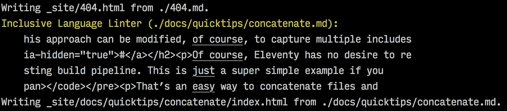

# eleventy-plugin-inclusive-language

An [Eleventy](https://github.com/11ty/eleventy) linter plugin to check for inclusive language in markdown files. Inspired by [_CSS Tricks’ Words to Avoid in Educational Writing_](https://css-tricks.com/words-avoid-educational-writing/). No browser/client JavaScript here—everything is this plugin is done at build-time.



## Installation

Available on [npm](https://www.npmjs.com/package/@11ty/eleventy-plugin-inclusive-language).

```
npm install @11ty/eleventy-plugin-inclusive-language --save-dev
```

Open up your Eleventy config file (probably `.eleventy.js`) and use `addPlugin`:

```js
const inclusiveLangPlugin = require("@11ty/eleventy-plugin-inclusive-language");

module.exports = function(eleventyConfig) {
  eleventyConfig.addPlugin(inclusiveLangPlugin);
};
```

Read more about [Eleventy plugins.](https://www.11ty.io/docs/plugins/)

### Options

Optionally pass in an options object as the second argument to `addPlugin` to further customize this plugin.

```
const inclusiveLangPlugin = require("@11ty/eleventy-plugin-inclusive-language");

module.exports = function(eleventyConfig) {
  eleventyConfig.addPlugin(inclusiveLangPlugin, {
    templateFormats: ["md"], // default, add more file extensions here

    // accepts an array or a comma-delimited string
    words: "simply,obviously,basically,of course,clearly,just,everyone knows,however,easy"
  });
};

```
